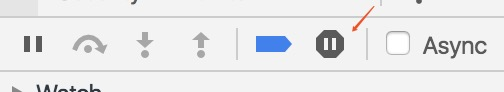

### Can I prevent that Chrome (v45) pauses on promise rejections?

Chrome only does this if you have "pause on uncaught exception" turned on in the "Sources" tab.

enter image description here



If you untick it it will not pause on errors.

A promise rejection is conceptually an error. It is the correct way to mentally model it, otherwise the following are silent errors:

```
Promise.resolve().then(function(){
    JSON.prase("{}"); // unhandled rejection, TypeError, typo
    foooooo = 15; // unhandled ReferenceError, undefined
});
```
And so on.

If you want to explicitly suppress a rejection, which is akin to a synchronous "catch all" you'd do the same thing you do in synchronous code:
```
try {
   doSomething();
} catch(e){
    // explicitly ignore all errors.
}
```
With promises:
```
doSomething().catch(function(){});
```